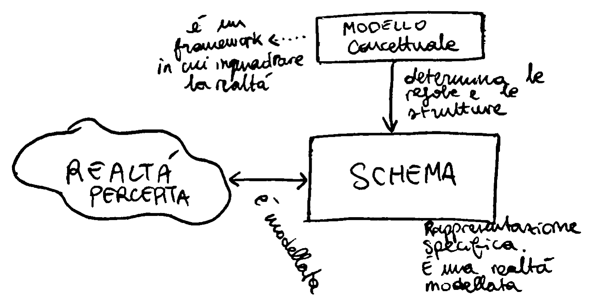

# Progettazione concettuale

L’obiettivo della progettazione concettuale è rappresentare la realtà a un alto livello di astrazione. Per le basi di dati esistono diversi modelli concettuali, ma lo standard de-facto è il modello Entity-Relationship.

La creazione di un diagramma E-R procede in modo incrementale, raffinando e arricchendo a ogni passo la nostra percezione della realtà, per sviluppare formalmente lo schema concettuale.

Vedremo come sviluppare uno schema E-R da requisiti in linguaggio naturale e da file esistenti.

# Modelli concettuali

Il **modello** è l’insieme di regole e strutture che permettono di rappresentare la realtà di interesse. Il modello E-R ha un insieme di regole e di strutture (entità e associazioni) che mi permettono di modellare la mia realtà.

Uno **schema** è la rappresentazione della realtà secondo un determinato modello.

Il modello fornisce quindi le regole per costruire l’astrazione. La realtà di interesse è solo una porzione del mondo reale, filtrata dalla percezione di chi sviluppa la rappresentazione.

## Astrazione

L’astrazione è il processo, innato nell’uomo, che porta a evidenziare alcune proprietà e caratteristiche di un insieme di oggetti; trascurandone altre giudicate non rilevanti.

Le primitive di astrazione comuni a ogni livello sono:

### Classificazione

porta a definire una classe da un insieme di oggetti che sono caratterizzati da proprietà comuni.

**I membri della classe SETTIMANA sono Lunedì, Martedì, …, Domenica.**

La relazione che esiste tra un elemento della classe e la classe stessa è **MEMBER_OF**

### Generalizzazione

definisce una relazione di sovrainsieme tra una classe padre e le classi figlie (sottoclassi).

Questa relazione tra sottoclassi e classe padre è un mapping, che si caratterizza in base alla copertura.

- Parliamo di **copertura totale** quando ogni elemento della classe generica è in relazione con **almeno** un’elemento delle classi generalizzate;
- la copertura è **parziale** quando esistono alcuni elementi della classe generica che non sono in relazione con alcun elemento delle classi generalizzate.
- inoltre è esclusiva quando ogni elemento della classe generica è in relazione con al massimo un elemento delle classi generalizzate;
- overlapping quando esistono elementi della classe generica in relazione con più di un elemento delle classi generalizzate.

La generalizzazione è una relazione di tipo **IS_A**.

### Aggregazione

L’aggregazione permette di definire un concetto composto a partire da altri concetti che ne rappresentano le parti componenti.

Ad esempio una classe BICICLETTA è composta da MANUBRIO, PEDALE, TELAIO, RUOTA.

La relazione che esiste tra ogni concetto componente e il concetto composto è di tipo **PART_OF**.

L’aggregazione stabilisce quindi una corrispondenza tra gli elementi di una classe componente e gli elementi della classe composta.

L’aggregazione binaria è una corrispondenza stabilita tra due classi.

# Cardinalità

Consideriamo una relazione di aggregazione A, tra $C_1$ e $C_2$.

La cardinalità minima di C1 in A è il numero minimo di corrispondenze nell’aggregazione A, alle quali ogni membro di C1 deve partecipare.

La cardinalità massima di C1 in A è il numero massimo di corrsipondenze nell’aggregazione A, alle quali ogni membro di C1 deve partecipare.

La partecipazione si dice **opzionale** quando la cardinalità minima è uguale a 0, mentre si dice **obbligatoria** quando la cardinalità minima è maggiore strettamente di zero.

min-card(C1, A) = 0 → partecipazione opzionale.

min-card(C1, A) > 0 → obbligatoria.

## Aggregazione binaria

- Uno a uno (one to one). Ogni C1 è mappato al massimo a un C2.
    - max-card(C1, A) = 1 e max-card(C2, A) = 1
- Uno a molti (one to many) ogni C1 è mappato a più di un C2
    - max-card(C1, A) = n
    - max-card(C2, A) = 1
- Molti a uno (many to one). Ogni C1 è mappato a un solo C2, ma più C1 possono essere mappati allo stesso C2.
    - max-card(C1, A) = 1
    - max-card(C2, A) = n
- Molti a molti. Ogni C1 è mappato a più C2 e viceversa
    - max-card(C1, A) = n
    - max-card(C2, A) = n

## Aggregazione n-aria

Viene stabilita fra tre o più classi C1, C2, Cn

La cardinalità minima di Ci in A (min-card(Ci, A)) è il numero minimo di corrispondenze nell’aggregazione alle quali ogni membro di Ci deve partecipare.